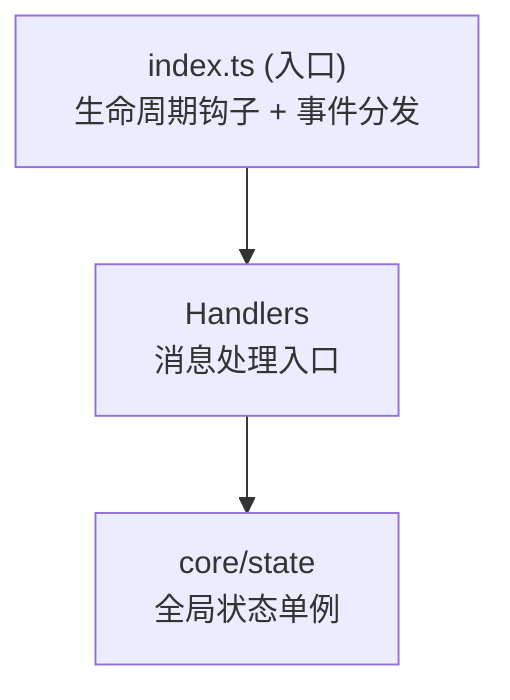

# NapCat 插件开发模板

一个快速开始 NapCat 插件开发的模板项目，基于实际生产项目架构提炼而成。

## 项目结构

```
napcat-plugin-template/
├── src/
│   ├── index.ts              # 插件入口，导出生命周期函数
│   ├── config.ts             # 配置定义和配置 Schema
│   ├── types.ts              # TypeScript 类型定义
│   ├── core/
│   │   └── state.ts          # 全局状态管理单例
│   └── handlers/
│       └── message-handler.ts # 消息处理器（命令解析、CD 冷却、消息工具）
├── .github/
│   ├── workflows/
│   │   └── release.yml        # CI/CD 自动构建发布
│   └── copilot-instructions.md
├── package.json
├── tsconfig.json
├── vite.config.ts
└── README.md
```

## 快速开始

### 1. 安装依赖

```bash
pnpm install
```

### 2. 修改插件信息

编辑 `package.json`，修改 `name`、`description`、`author` 等字段。

### 3. 开发你的功能

- **添加配置项**: 编辑 `src/types.ts` 和 `src/config.ts`
- **消息处理**: 编辑 `src/handlers/message-handler.ts`
- **状态管理**: 编辑 `src/core/state.ts`

### 4. 构建

```bash
pnpm run build
pnpm run typecheck
```

### 5. 调试与热重载

项目通过 Vite 插件 `napcatHmrPlugin` 集成了热重载能力，需要在 NapCat 端安装 `napcat-plugin-debug` 插件并启用。

```bash
pnpm run deploy   # 构建并自动部署 + 重载
pnpm run dev      # watch 模式，每次构建后自动部署 + 重载
```

构建产物在 `dist/` 目录：

```
dist/
├── index.mjs
└── package.json
```

## 架构说明



| 模式 | 实现位置 | 说明 |
|------|----------|------|
| 单例状态 | `src/core/state.ts` | `pluginState` 全局单例，持有 ctx、config、logger |
| 配置校验 | `sanitizeConfig()` | 类型安全的运行时配置验证 |
| CD 冷却 | `cooldownMap` | `Map<groupId:command, expireTimestamp>` |

## 生命周期函数

| 导出 | 说明 |
|------|------|
| `plugin_init` | 插件初始化，加载配置 |
| `plugin_onmessage` | 消息事件处理 |
| `plugin_cleanup` | 插件卸载，清理资源 |
| `plugin_config_ui` | NapCat 配置面板 Schema |
| `plugin_get_config` | 获取配置 |
| `plugin_set_config` | 设置配置 |
| `plugin_on_config_change` | 配置变更回调 |

## 编码约定

### 状态访问

```typescript
import { pluginState } from '../core/state';

const config = pluginState.config;
pluginState.log('info', '消息内容');
pluginState.updateGroupConfig(groupId, { enabled: true });
await pluginState.callApi('send_group_msg', { group_id, message });
```

### 消息发送

```typescript
import {
    sendGroupMessage, sendPrivateMessage,
    textSegment, imageSegment, atSegment, replySegment,
} from '../handlers/message-handler';

await sendGroupMessage(ctx, groupId, [
    replySegment(messageId),
    textSegment('消息内容'),
]);
```

## CI/CD 自动发布

推送 `v*` 格式的 tag 即可自动构建并创建 GitHub Release：

```bash
git tag v1.0.0
git push origin v1.0.0
```

Release 包仅包含 `index.mjs` 和 `package.json`。

## 部署

将 `dist/` 目录的内容复制到 NapCat 的插件目录，或从 GitHub Release 下载 zip 包解压到 `plugins` 目录。

## 许可证

MIT License
